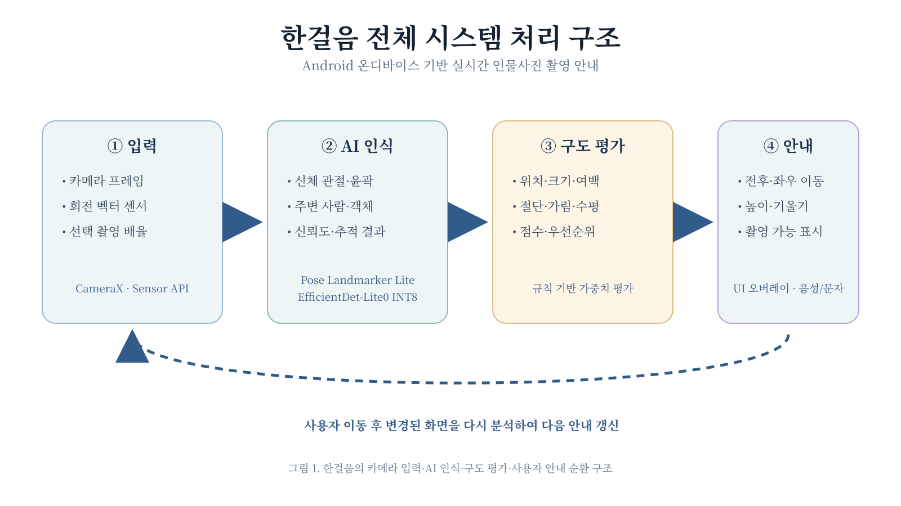

# 6. 기술 분석

본 작품은 스마트폰 카메라 화면에서 인물과 주변 장면을 분석하고, 촬영자가 수행할 수 있는 이동 및 카메라 조정 방법을 실시간으로 안내하는 시스템이다. 따라서 기술을 선정할 때는 인물 검출 정확도뿐 아니라 Android 환경에서의 실시간 처리 가능성, 기기별 호환성, 온디바이스 구동 여부, 개발 기간 및 결과의 설명 가능성을 함께 고려해야 한다.

초기 구현은 여러 AI 모델을 동시에 학습하는 방식보다 사전 학습된 경량 모델을 활용해 인물과 주변 객체를 인식하고, 그 결과를 규칙 기반 구도 평가 알고리즘으로 처리하는 구조를 사용한다. 이를 통해 제한된 개발 기간 안에서 핵심 기능을 구현하고, 각 안내가 어떤 구도 문제로 인해 발생했는지 확인할 수 있도록 한다.

## 6.1 전체 시스템 처리 구조

한걸음의 전체 처리 과정은 카메라 및 센서 입력, AI 인식, 구도 평가, 사용자 안내 단계로 구성한다.

> **그림 1. 한걸음의 전체 시스템 처리 구조**

카메라 영상이 입력되면 인물의 신체 특징과 주변 객체를 검출하고, 스마트폰 센서에서 카메라의 기울기 정보를 얻는다. 이후 인물의 위치와 크기, 여백, 신체 절단 여부, 수평 및 주변 요소의 간섭을 평가한다. 평가 결과는 촬영자가 수행할 수 있는 전후·좌우 이동과 카메라 높이·기울기 안내로 변환된다. 사용자가 안내에 따라 움직이면 변경된 카메라 화면을 다시 분석하여 다음 안내를 갱신한다.

시스템은 서버에서 영상을 분석하는 방식이 아닌 스마트폰 내부에서 처리하는 온디바이스 방식을 기본으로 한다. 서버 방식은 네트워크 상태에 따라 안내가 지연될 수 있고, 촬영 대상의 얼굴과 주변 사람이 포함된 영상이 외부로 전송된다는 개인정보 문제가 발생할 수 있다. 온디바이스 방식은 네트워크 연결 없이 작동할 수 있고 카메라 프레임을 외부에 저장하거나 전송하지 않아도 된다는 장점이 있다.

모든 기능을 하나의 대형 AI 모델로 처리하면 연산량이 증가하고 판단 이유를 설명하기 어려워진다. 따라서 인물 검출, 주변 객체 검출, 기기 각도 측정 및 구도 평가를 각각 분리한 모듈형 구조를 사용하며, 각 모듈의 결과를 최종 구도 평가 단계에서 결합한다.

## 6.2 카메라 영상 처리 기술

Android 카메라를 제어하는 방법에는 Camera2 API와 CameraX가 있다. Camera2는 초점, 노출 및 센서 설정을 세밀하게 제어할 수 있지만 기기별 카메라 특성을 직접 처리해야 하므로 구현 복잡도가 높다. 본 작품의 핵심은 전문가용 수동 카메라 제어가 아니라 카메라 화면을 실시간으로 분석하고 안내 정보를 표시하는 것이므로 CameraX를 선택한다.

CameraX는 카메라 미리보기, 사진 촬영 및 이미지 분석 기능을 각각의 사용 사례로 제공하며 Android 생명주기와 연결할 수 있다. 특히 `ImageAnalysis`를 이용하면 미리보기 화면을 유지하면서 AI 모델에 전달할 카메라 프레임을 별도로 얻을 수 있다.

한걸음에서는 촬영자가 이미 이동한 뒤 과거 프레임을 분석하는 것보다 현재 화면을 빠르게 반영하는 것이 중요하다. 따라서 모든 프레임을 순서대로 처리하는 방식보다 오래된 프레임을 버리고 최신 프레임만 분석하는 `STRATEGY_KEEP_ONLY_LATEST` 방식을 사용한다. 카메라 화면은 일반적인 프레임 속도로 표시하되 AI 분석은 기기 성능에 따라 일정한 간격으로 실행하도록 분리한다.

## 6.3 인물 및 신체 특징 검출 기술

인물 촬영 구도를 평가하려면 단순히 사람이 화면 안에 존재하는지만 확인해서는 부족하다. 머리와 발의 위치, 신체가 화면 밖으로 잘렸는지, 인물이 어느 방향으로 치우쳤는지 등을 판단하기 위해서는 신체 관절 좌표가 필요하다.

후보 기술로는 ML Kit Pose Detection, MoveNet 및 MediaPipe Pose Landmarker를 고려하였다. ML Kit Pose Detection은 Android 연동이 간단하고 실시간 처리 성능이 우수하지만 스트림 모드에서는 화면에서 가장 두드러지는 한 명을 중심으로 추적한다. 또한 현재 공식 문서상 베타 API로 제공되고 있다.

본 작품에서는 MediaPipe Pose Landmarker의 경량 모델을 사용한다. 이 기술은 카메라 입력을 위한 `LIVE_STREAM` 모드, 한 사람당 33개의 신체 랜드마크, 최대 검출 인원 설정, 이미지 좌표와 3차원 신체 좌표 및 선택적 세그멘테이션 마스크 출력을 지원한다. Android용 예제 코드도 제공되므로 개발 기간과 구현 위험을 줄일 수 있다.

검출된 랜드마크 중 코, 어깨, 골반, 무릎, 발목 및 발끝 좌표를 중심으로 전신 검출 여부를 확인한다. 전체 랜드마크의 최소·최대 좌표를 이용해 인물 영역을 계산하고, 화면 내 인물의 중심점과 점유율 및 상하좌우 여백을 산출한다.

## 6.4 주변 인물 및 객체 검출 기술

MediaPipe Pose Landmarker는 주 피사체의 신체 정보를 얻는 데 적합하지만 관광지에서 주 피사체 주변에 있는 다른 사람이나 사물을 모두 안정적으로 검출하는 데에는 한계가 있다. 특히 신체 일부만 보이는 주변 사람은 자세 랜드마크가 충분히 검출되지 않을 수 있다.

이를 보완하기 위해 MediaPipe Object Detector와 EfficientDet-Lite0 모델을 보조적으로 사용한다. EfficientDet-Lite0는 320×320 크기의 입력을 사용하고 사람을 포함한 COCO 데이터셋의 객체 범주를 검출할 수 있다. EfficientDet-Lite2는 정확도가 높지만 연산량이 크고, SSD MobileNetV2는 더 빠르지만 정확도가 낮다는 특성이 있다. 본 작품은 실시간성과 주변 사람 검출 정확도의 균형을 위해 EfficientDet-Lite0의 INT8 모델을 우선 선택한다.

객체 검출 결과를 이용해 주변에 사람이 몇 명 존재하는지를 단순 감점하지는 않는다. 다른 사람이나 객체의 검출 영역이 주 피사체의 얼굴 또는 주요 신체 부위와 겹치는지, 피사체의 윤곽을 구분하기 어렵게 만드는지를 중심으로 판단한다. 관광지의 군중이나 조형물은 장소의 특성이 될 수 있으므로 존재 자체를 부정적인 요소로 처리하지 않는다.

객체 검출 모델까지 매 프레임 실행하면 연산량이 증가한다. 따라서 인물 자세 검출은 비교적 자주 수행하고, 객체 검출은 더 낮은 주기로 실행하거나 주변 간섭 확인이 필요한 경우에만 활성화한다.

## 6.5 카메라 기울기 및 촬영자 이동 판단

카메라의 수평과 기울기는 영상 속 수평선을 검출하는 방법과 스마트폰 센서를 사용하는 방법으로 측정할 수 있다. 영상 기반 수평선 검출은 건물이나 바닥의 직선이 뚜렷한 환경에서는 작동하지만 자연 풍경이나 사람이 많은 장소에서는 기준선을 안정적으로 찾기 어렵다.

한걸음에서는 Android의 회전 벡터 센서를 이용해 카메라의 기울기와 회전 상태를 측정한다. 촬영 과정에서는 절대적인 북쪽 방향보다 사용자가 카메라를 얼마나 기울였는지가 중요하므로 자기장 영향을 받지 않고 상대 회전을 측정할 수 있는 `TYPE_GAME_ROTATION_VECTOR`를 우선 사용한다.

스마트폰 센서만으로 촬영자의 실제 전후·좌우 이동 거리를 정확하게 구하는 것은 어렵다. 가속도 센서 값을 적분해 위치를 계산하면 작은 오차가 빠르게 누적되기 때문이다. 따라서 센서로 촬영자의 위치를 직접 추적하지 않고 연속된 카메라 화면에서 나타나는 인물의 크기와 중심점 변화를 이용한다.

- 인물 크기가 목표보다 작으면 촬영자에게 앞으로 이동하도록 안내한다.
- 인물 크기가 목표보다 크면 뒤로 이동하도록 안내한다.
- 인물 중심이 화면 좌우로 치우치면 촬영 위치 또는 카메라 방향 조정을 안내한다.
- 카메라의 좌우 기울기는 회전 벡터 센서로 측정한다.
- 상하 각도는 인물의 머리·발 위치와 센서의 피치 값을 함께 이용한다.

이 방식은 LiDAR나 특정 제조사의 깊이 센서를 요구하지 않으므로 다양한 Android 스마트폰에서 사용할 수 있다.

## 6.6 구도 평가 및 점수 계산

사진의 미적 품질 전체를 하나의 AI 모델로 판단하는 방식도 고려할 수 있지만, 감성적인 사진의 기준은 사용자와 장소에 따라 달라질 수 있다. 또한 미적 점수만 출력하면 점수가 낮은 이유와 촬영자가 무엇을 변경해야 하는지를 설명하기 어렵다.

초기 버전에서는 학습 기반 미학 평가 모델이나 강화학습보다 규칙 기반 가중치 점수 방식을 사용한다.

\[
C=w_pP+w_sS+w_mM+w_lL+w_bB
\]

- `P`: 화면 내 인물 위치 점수
- `S`: 인물 크기와 화면 점유율 점수
- `M`: 머리 위·발아래·좌우 여백 점수
- `L`: 수평과 카메라 기울기 점수
- `B`: 신체 절단 및 주변 요소 간섭 점수
- `w`: 각 평가 항목의 가중치

인물이 화면 밖으로 잘리거나 얼굴이 가려지는 문제는 촬영 결과에 미치는 영향이 크므로 높은 우선순위를 부여한다. 반면 인물의 중심 위치나 여백은 의도에 따라 달라질 수 있으므로 허용 범위를 두고 완만하게 감점한다.

강화학습은 촬영자의 연속된 행동에 따라 보상을 부여할 수 있다는 장점이 있지만 좋은 촬영 결과를 정의한 대량의 상태·행동·보상 데이터와 반복 가능한 학습 환경이 필요하다. 현재 프로젝트에서는 이러한 데이터를 확보하기 어렵고, 잘못 학습된 보상 기준이 사용자에게 불필요한 이동을 요구할 가능성이 있다. 따라서 강화학습은 초기 구현 범위에서 제외하고 규칙 기반 평가 결과를 사용자 실험으로 조정한다.

## 6.7 촬영 안내 결정 방식

여러 구도 문제가 동시에 발생하더라도 모든 지시를 한꺼번에 제공하면 사용자가 어느 행동을 먼저 해야 하는지 판단하기 어렵다. 따라서 각 평가 항목의 현재 점수와 개선 가능성을 계산한 뒤 가장 큰 문제가 되는 행동 하나를 우선 안내한다.

예를 들어 인물이 화면에서 작고 수평도 기울어진 경우 먼저 촬영자가 앞으로 이동하도록 안내한다. 인물 크기가 허용 범위에 들어오면 카메라 수평 조정을 안내한다. 안내 문장은 촬영자가 바로 수행할 수 있는 행동 형태로 제공한다.

- 한 걸음 앞으로 이동하세요.
- 조금 뒤로 이동하세요.
- 카메라를 오른쪽으로 이동하세요.
- 카메라를 조금 낮추세요.
- 휴대폰의 왼쪽을 내려 수평을 맞추세요.

프레임마다 분석 결과가 조금씩 달라지면 안내 문장이 계속 변경될 수 있다. 이를 방지하기 위해 최근 여러 프레임의 좌표와 점수를 평균화하고, 일정 시간 이상 동일한 문제가 유지될 때만 안내를 변경한다. 정상 범위에 진입한 직후 바로 다른 지시가 발생하지 않도록 진입 기준과 이탈 기준을 다르게 설정하는 히스테리시스 방식도 적용한다.

## 6.8 실시간 처리 최적화

스마트폰에서 Pose Landmarker와 Object Detector를 동시에 계속 실행하면 기기 발열과 배터리 사용량이 증가하고 카메라 미리보기 지연이 발생할 수 있다. 이를 줄이기 위해 다음 방법을 적용한다.

- CameraX에서 최신 프레임만 분석한다.
- AI 모델 입력 해상도를 원본 카메라 해상도보다 낮게 설정한다.
- Pose Landmarker의 경량 모델을 사용한다.
- 객체 검출 모델은 INT8 양자화 모델을 사용한다.
- 자세 검출과 객체 검출의 실행 주기를 분리한다.
- AI 추론을 UI 스레드와 분리한다.
- 이전 프레임의 인물 위치를 추적해 불필요한 재검출을 줄인다.
- 점수 변화가 작은 경우 기존 안내를 유지한다.

LiteRT의 학습 후 양자화는 모델 크기를 줄이고 CPU 또는 하드웨어 가속기에서의 처리 지연을 개선할 수 있다. 다만 양자화 과정에서 정확도가 감소할 수 있으므로 원본 모델을 기준 성능으로 측정한 뒤 INT8 또는 float16 모델과 비교해 최종 형식을 선택한다.

## 6.9 기술 선정 요약

| 기능 | 선택 기술 | 선택 이유 |
|---|---|---|
| 카메라 입력 | CameraX | Android 기기 호환성과 실시간 이미지 분석 지원 |
| 전신 인물 분석 | MediaPipe Pose Landmarker Lite | 33개 관절, 다중 인물, 세그멘테이션 및 실시간 추적 |
| 주변 객체 분석 | EfficientDet-Lite0 INT8 | 모바일 환경에서 정확도와 속도의 균형 |
| 카메라 기울기 | Game Rotation Vector Sensor | 영상 속 수평선이 없어도 상대 기울기 측정 가능 |
| 구도 판단 | 규칙 기반 가중치 점수 | 판단 이유를 설명하고 안내 행동으로 변환하기 쉬움 |
| 모바일 추론 | MediaPipe Tasks·LiteRT | 온디바이스 구동과 모델 경량화 지원 |
| 안내 안정화 | 이동평균·임계값·히스테리시스 | 안내가 빠르게 바뀌는 현상 방지 |

## 참고 자료

1. Android Developers, [Image analysis](https://developer.android.com/media/camera/camerax/analyze).
2. Google AI Edge, [Pose landmark detection guide for Android](https://ai.google.dev/edge/mediapipe/solutions/vision/pose_landmarker/android).
3. Google AI Edge, [Object detection task guide](https://ai.google.dev/edge/mediapipe/solutions/vision/object_detector/index).
4. Android Developers, [Position sensors](https://developer.android.com/develop/sensors-and-location/sensors/sensors_position).
5. Google AI Edge, [Post-training quantization](https://ai.google.dev/edge/litert/performance/post_training_quantization).
6. Google ML Kit, [Detect poses with ML Kit on Android](https://developers.google.com/ml-kit/vision/pose-detection/android).
